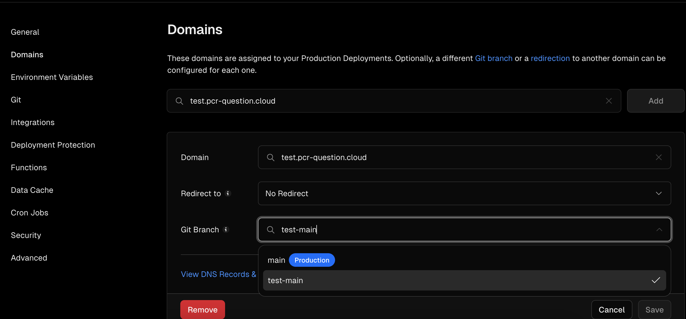
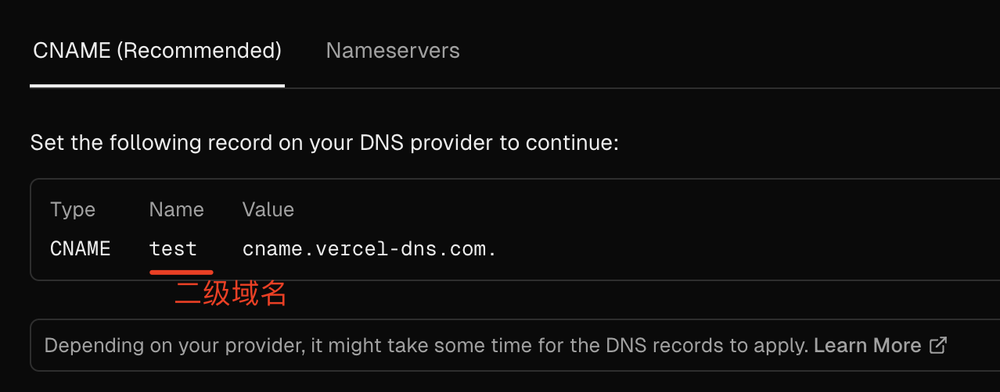
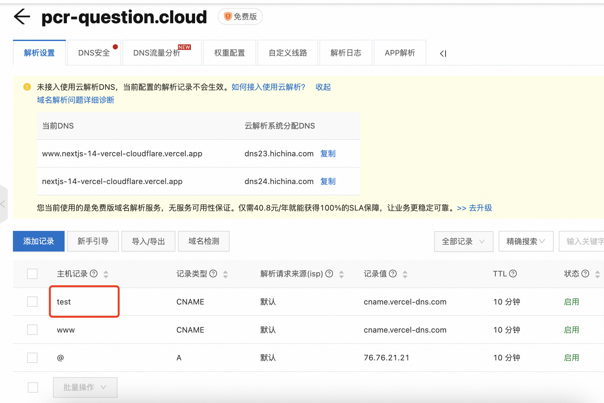
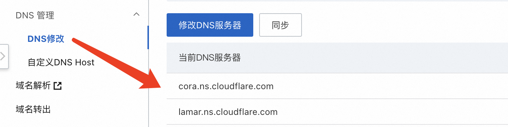
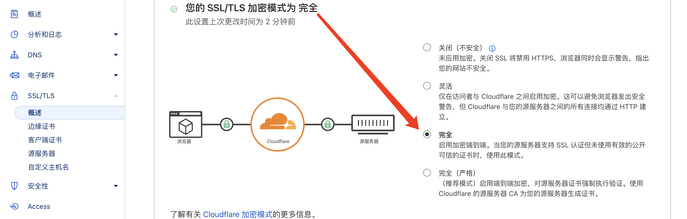

## elysiajs 全家桶

- `@elysiajs/eden` 类型安全 Type Safety 🌟🌟🌟🌟🌟
   https://elysiajs.com/eden/overview.html

- `@elysiajs/swagger` 自动生成 Swagger 接口文档

- `@elysiajs/cors` 用于跨源请求 (COR) 的 Elysia 插件

## Vercel

> 管理后台：https://vercel.com/1uokuns-projects/nextjs-14-vercel-cloudflare 
> 免费域名：https://nextjs-14-vercel-cloudflare.vercel.app/ 
> (由于免费域名的 DNS 解析被 🧱 了，最好再注册一个国内域名)

- `Domains` 域名设置

  - **正式环境域名**：https://pcr-question.cloud/ —— 分支`main`
  - **测试环境域名**：https://test.pcr-question.cloud/ —— 分支`test-main`
     当设置一个二级域名时，vercel 才允许选择 Git Branch
     
     此时 DNS 解析`Name`也同二级域名
     
     

## Cloudflare

- `Turnstile` 验证码服务

  - **DNS 解析**
     添加名称服务器（Nameservers）以激活服务
     
     如果遇到“`将您重定向的次数过多。`”问题，要将 SSL 证书的配置改为“完全”
     
     参考：https://willmo.js.cool/posts/11926760/

  - **客户端内嵌验证码组件**
     https://www.red-gate.com/simple-talk/featured/cloudfare-turnstile-a-new-way-to-prove-you-are-real/
